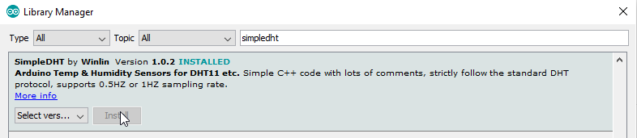

# Duinotech Thermostat


Here's a project that will take you into the world beyond the basics of the Duinotech Learning Kit. We're going to build a project that shows how we can use the Learning Kit with other modules, and also how to incorporate an external library to extend our programming possibilities. It's a thermostat, which is nothing more than a relay which responds to temperature. We've added some colour to it by connecting some LED's to give an indication of the current temperature.

## Shopping

|Qty| Code | Description |
|---|---|---|
|1 | [XC3900](http://jaycar.com.au/p/XC3900) | Duinotech Learning Kit
|1 | [XC4520](http://jaycar.com.au/p/XC4520) | Temperature and Humidity Sensor
|1 | [XC4419](http://jaycar.com.au/p/XC4419) | Relay Module
|1 | [WC6028](http://jaycar.com.au/p/WC6028) | Plug-socket jumper leads

## Construction

See the below diagram for how the project is put together. Note that we'll need some of the Breadboard, LED's and 470 Ohm resistors as well as the Uno and Plug-Plug Jumper Leads.


*Image created with Fritzing*

## Table of Connections

|Uno|LED’s|XC4520|XC4419
|---|---|---|---
|D2,D3,D4,D5|Green LED’s anode via 470 Ohm resistor and back to GND|||
|D6,D7,D8,D9|Red LED’s anode via 470 Ohm resistor and back to GND|||
|D11||S||
|D13|||S
|GND|To all Cathodes|-|-
|5V||+ (middle)|+ (middle)
## Library Code

This might be the first time you have tried to use a library with the Arduino IDE. In this case, we are using a library called SimpleDHT (the sensor inside the XC4520 is based around a chip called DHT11). To do this, click on Sketch>Include Libraries>Manage Libraries. This will open the Library Manager.


After the Library Manager has done its updates, type 'simpledht' (without quotes) in the search box- there should be one result, which is the library we want to install. Click it and then click install.



After this, you can close the Library Manager. You can see that the library is correctly installed by checking under File>Examples>SimpleDHT>DHT11Default. Many libraries have examples, and this is a great way to see the features and usage of a library.


If you have a look at the DHT11Default example, you might see there are a few strange looking pieces of code. Let's see how it works.

The first thing you'll usually need to do when using a library is to let the Arduino IDE know that you want to use it:

```c
#include <SimpleDHT.h>
```

Note that the statement starts with a hash, and doesn't end with a semi-colon. This is called a compiler directive, and is one of the first things that gets processed when a sketch is uploaded. The #include directive simply means to include the contents of another file (it's not quite that simple, but that's the one-minute overview). This file includes all the other functions that we'll use, so we need to make sure the #include happens before anything else relating to the library in the sketch.

```c
int pinDHT11 = 2;
```

This command isn't necessarily related to the library, but it simply sets a variable that we can use later to identify the pin that we've connected the sensor. This is a good habit to use for writing sketches, as you can easily change the pin that something is connected to, especially if you have to use the pin in multiple places. Then it only needs to be changed in one easy-to-find place at the start of the sketch.

```c
SimpleDHT11 dht11;
```

This might look a lot like a variable declaration, but it's called a constructor- we're constructing an instance of the SimpleDHT11 object, which we can later interact with. The obvious side-effect of this is that we can have more than one object, and we need to be able to tell them apart. If a library doesn't seem to use a constructor in its examples, it can probably only handle one instance at a time, and this instance will usually have a default name (Serial is an example of this).

The final step is actually using the created object to access the features of the library.

```c
byte temperature = 0;
byte humidity = 0;
if (dht11.read(pinDHT11, &temperature, &humidity, NULL)) {
  Serial.print("Read DHT11 failed.");
  return;
}
```
Note the use of the dht11.read() structure- it is similar to Serial.read() in that we have a function (read) that depends on what object it is attached to, and also that we are using the previously constructed dht11 object in this case, and using the pinDHT11 variable to tell the function which pin to read.

Because this sensor can return two different data values (temperature and humidity), we need a way of reading these two values. A function can only ever return one value, so in this case, we create two variables (temperature and humidity) and tell the function to put the values in these variables. The '&' before temperature and humidity means 'the address of'. The function doesn't care about the values in the variables, it just needs to know where the variables are kept so it knows where to put its values. This is a part of C and Arduino called pointers, and they are easy to get wrong. The last argument in the brackets 'NULL' is a feature of this library that we're not using in this sketch. Its use is demonstrated in the 'DHT11WithRawBits' example.

You might also notice that we can see if the sensor read has failed or not. The actual value returned by the dht11.read() function tells us this- if this function returns TRUE, then the sensor read has failed, in which case we shouldn't trust the values in 'temperature' and 'humidity'.

If you've already wired up the project, then all you need to do to test it is to change this line:

```c
int pinDHT11 = 2;
```

to read

```c
int pinDHT11 = 11;
```

to match the actual pin we are using. Then you can upload the sketch and open the Serial Monitor to test the sensor is working. You can see that it is responding to changes by breathing onto the sensor- it should register an increase in temperature and humidity from the breath.

## Project Code

Use the Duinotech_Thermostat.ino code to program the Uno. The code has been commented to explain a bit about what the different parts do. To test it, change the setpoint so that 2 or 3 green LED's light up, then breathe on it to increase the temperature- you should see more LED's light up, and the relay activate.

## Improvements

The great thing about using an Arduino for these sort of projects is being able to customise it. For example, if you were using the thermostat to activate a cooling fan for your PC, you could add a second fan which gets activated at a higher temperature, or add a buzzer to sound a warning tone if the temperature keeps increasing.

If you're ready for an even more advanced project, take a look at the
[Arduino Ethernet IO Controller](https://jaycar.com.au/diy-ethernet-controller)
to see how you can control and monitor these things through a web page.
